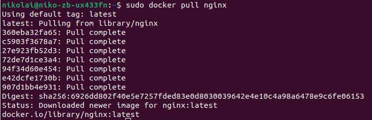

## Part 1. Готовый докер

+ ### Взять официальный докер образ с nginx и выкачать его при помощи docker pull

||
|:--:|
|*Рис.1.1 - sudo docker pull nginx*|

+ ### Проверить наличие докер образа через docker images

||
|:--:|
|*Рис.1.2 - sudo docker images*|

+ ### Запустить докер образ через docker run -d [image_id|repository]

||
|:--:|
|*Рис.1.3 - sudo docker run -d f5a6b296b8a2*|

+ ### Проверить, что образ запустился через docker ps

||
|:--:|
|*Рис.1.4 - sudo docker ps*|

+ ### Посмотреть информацию о контейнере через docker inspect [container_id|container_name]

...
|
|:--:|
|*Рис.1.5.1 - sudo docker inspect bfa24e7c555a*|

+ ### По выводу команды определить и поместить в отчёт

   + размер контейнера в байтах = 186640937 (командой sudo docker inspect --size bfa24e7c555a -f '{{ .SizeRootFs }}'). Примерно 187 MB.
   
    ||
    |:--:|
    |*Рис.1.5.2 - размер контейнера в байтах*|

   + список замапленных портов (командой sudo docker port bfa24e7c555a):
   
    ||
    |:--:|
    |*Рис.1.5.3 - нет замапленных портов контейнера*|

   + ip контейнера: 172.17.0.2 (командой sudo docker inspect --format='{{range .NetworkSettings.Networks}}{{.IPAddress}}{{end}}' bfa24e7c555a)

    ||
    |:--:|
    |*Рис.1.5.4 - ip контейнера: 172.17.0.2*|

+ ### Остановить докер образ через docker stop [container_id|container_name]

||
|:--:|
|*Рис.1.6 - sudo docker stop bfa24e7c555a*|

+ ### Проверить, что образ остановился через docker ps

||
|:--:|
|*Рис.1.7 - sudo docker ps*|

+ ### Запустить докер с портами 80 и 443 в контейнере, замапленными на такие же порты на локальной машине, через команду run

||
|:--:|
|*Рис.1.8 - sudo docker run -d -p 80:80 -p 433:433 f5a6b296b8a2*|

+ ### Проверить, что в браузере по адресу localhost:80 доступна стартовая страница nginx

||
|:--:|
|*Рис.1.9 - localhost:80*|

+ ### Перезапустить докер контейнер через docker restart [container_id|container_name]

||
|:--:|
|*Рис.1.10 - sudo docker restart 127b2c0ff5e3*|

+ ### Проверить любым способом, что контейнер запустился

||
|:--:|
|*Рис.1.11 - sudo docker ps*|

## Part 2. Операции с контейнером

+ ### Прочитать конфигурационный файл nginx.conf внутри докер контейнера через команду exec

||
|:--:|
|*Рис.2.1 - sudo docker exec container_name cat file_name*|

+ ### Создать на локальной машине файл nginx.conf
+ ### Настроить в нем по пути /status отдачу страницы статуса сервера nginx

||
|:--:|
|*Рис.2.1 - содержание отредактированного файла nginx.conf*|

+ ### Скопировать созданный файл nginx.conf внутрь докер образа через команду docker cp

||
|:--:|
|*Рис.2.3 - sudo docker cp nginx.conf container_name:path_to_file/*|

+ ### Перезапустить nginx внутри докер образа через команду exec

||
|:--:|
|*Рис.2.4 - sudo docker exec -it container_name nginx -s reload*|

+ ### Проверить, что по адресу localhost:80/status отдается страничка со статусом сервера nginx

||
|:--:|
|*Рис.2.5 - localhost:80/status*|

+ ### Экспортировать контейнер в файл container.tar через команду export

||
|:--:|
|*Рис.2.6 - sudo docker export container_name > file_name.tar*|

+ ### Остановить контейнер

||
|:--:|
|*Рис.2.7 - sudo docker stop container_name*|

+ ### Удалить образ через docker rmi [image_id|repository], не удаляя перед этим контейнеры

||
|:--:|
|*Рис.2.8 - sudo docker rmi image_name*|

+ ### Удалить остановленный контейнер

||
|:--:|
|*Рис.2.9 - sudo docker rm container_name*|

+ ### Импортировать контейнер обратно через команду import

|![sudo docker import -c 'CMD ["nginx", "-g", "daemon off;"]' file_name.tar my_image](screenshots/2.10.png)|
|:--:|
|*Рис.2.10 - sudo docker import -c 'CMD ["nginx", "-g", "daemon off;"]' file_name.tar my_image*|

+ ### Запустить импортированный контейнер

||
|:--:|
|*Рис.2.11 - sudo docker run -d -p 80:80 -p 433:433 container_name*|

+ ### Проверить, что по адресу localhost:80/status отдается страничка со статусом сервера nginx

||
|:--:|
|*Рис.2.12 - localhost:80/status*|
